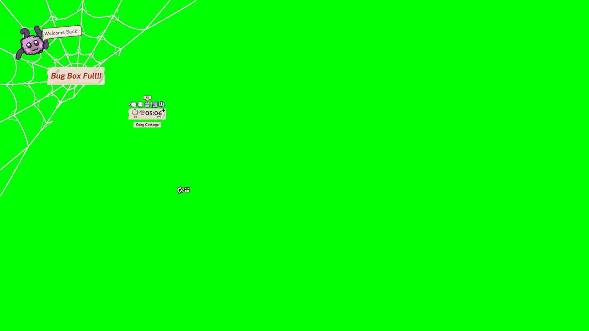
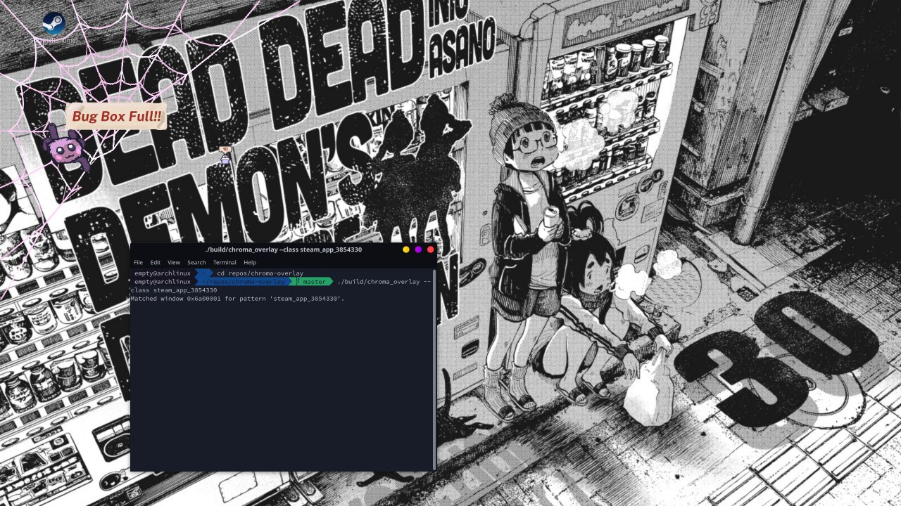

# chroma-overlay

A real-time **OpenGL/X11 compositor overlay** for Linux that turns green-screened (chroma-key) application windows into true per-pixel transparent overlays — while keeping them **fully interactive** and perfectly **cursor-aligned**.

This project was originally developed as a Linux compatibility prototype for games and applications that use green backgrounds to simulate transparency (such as *My Little Spider*).  
It demonstrates how native Linux compositors can achieve the same visual effect without any engine changes.

---


### Features

- **Chroma-keying**: Real-time removal of green backgrounds via GLSL shader  
- **True transparency**: Uses XComposite + OpenGL for per-pixel alpha blending  
- **Accurate input passthrough**: Clicks only land on opaque pixels; transparent areas are click-through  
- **Perfect cursor alignment**: No input or coordinate drift  
- **Zero modification** to the target application  
- Works on Cinnamon, GNOME, KDE, Xfce, and other composited X11 desktops

<p align="center">
  
  
</p>

<p align="center"><em>Left: Original window • Right: Transparent overlay</em></p>


## Build

Arch deps:
```bash
sudo pacman -S base-devel cmake gcc glfw-x11 glew libx11 libxcomposite libxext libxrender libxfixes
```

Then:
```bash
cmake -S . -B build -DCMAKE_BUILD_TYPE=Release
cmake --build build -j
```

---

## Run

1. Get the window id:
```bash
xwininfo
```
1.1 Get the window class:
```bash
xprop
```
3. Run the overlay (full-screen transparent window):
```bash
./build/chroma_overlay --class "My Little Spider"
```
or
```bash
./build/chroma-overlay --win-id 0x123456
```
> Note: X11 only (not Wayland) at the moment. Target window must be opened first.

If your compositor is active, green areas in the target window should appear **transparent**.

---


## Dependencies

| Library | Purpose |
|----------|----------|
| `libX11`, `libXcomposite`, `libXfixes`, `libXext` | Window capture and input shaping |
| `GLFW`, `GLEW`, `OpenGL` | Rendering and context management |
| `CMake >= 3.10` | Build system |

---

## Notes

- This uses `XComposite` + `GLX_EXT_texture_from_pixmap`.
- Overlay is click-through (XShape) and set above (EWMH hint).
- Shader thresholds live in `src/shaders/chromakey.frag` (tune them).
- If the target window resizes, we rebind the pixmap.
- NVIDIA: keep recent drivers; disable “Force Composition Pipeline” if you see lags.

---

## License
BSD 2-Clause — see [LICENSE](LICENSE). Commercial and open-source projects may reuse and adapt.
